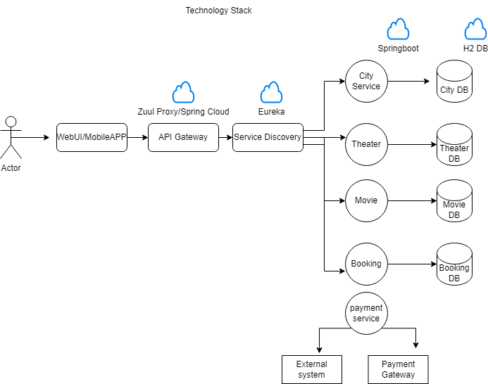
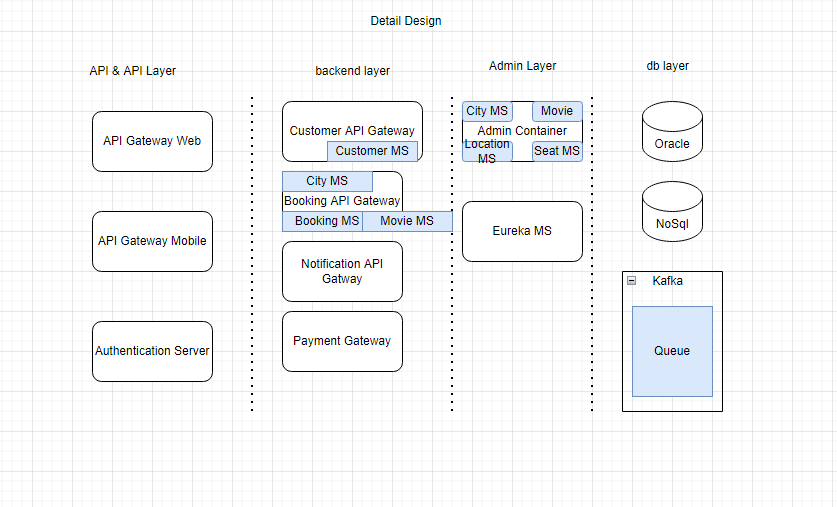

## Intent

The is movie ticker booking application based on microservice architecture

## Services


Real world example
* City Service: This Service deal with City related data e.g.
```java
abstract class ICityContoller {

    @Operation(summary = "Get all city", description = "Get all the cities")
    @ApiResponses(
            value = {
                 @ApiResponse(responseCode = "200", description = "Accepted")
            }
    )
    @GetMapping("/v1/cities")
    abstract ResponseEntity<List<City>> getCities();
```
* Theater : This Service deal with Theater for a given city.
* Movie: This Service deal with Movie data for a given theater.
* Show: This Service deal with Show for a given movie.
* Seat: This Service deal with Show for a given show.
* booking: This Service deal with booking movie and manage movie.

## Booking API Gateway
This API define routing rule to other microservices, hosted on 9001 port

http://localhost:9001

e.g.

[Get all the city data](http://localhost:9001/city/v1/cities)

[Get all the theater data](http://localhost:9001/theater/v1/theaters)

[Get all the movie data](http://localhost:9001/movie/v1/movies)

[Get all the show data](http://localhost:9001/show/v1/shows)

[Get all the seat data](http://localhost:9001/seat/v1/1/seat)


## Technology Stack


## Detail Design



